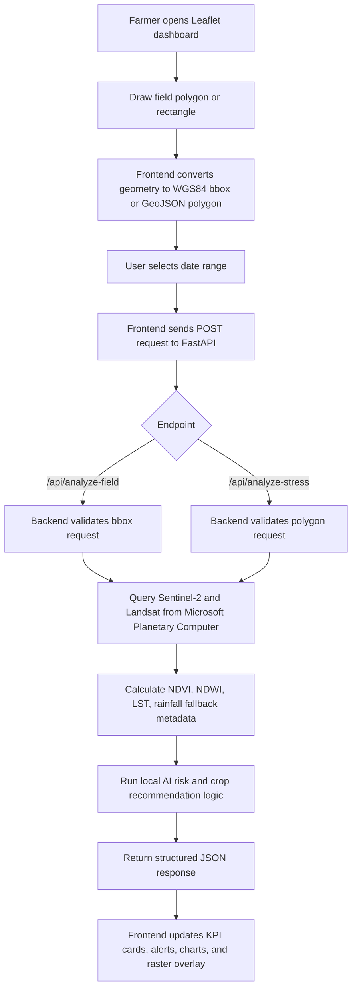
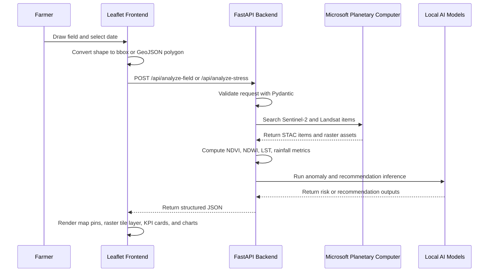

# Data Transfer Workflow

This document explains how field geometry and date inputs move from the web UI to the FastAPI backend, how the backend processes satellite data with Microsoft Planetary Computer, and how results are returned for map display.

## High-Level Flow



## Dashboard Data Send

The main dashboard uses a bounding box request.

Source file:

`frontend/app.js`

Backend endpoint:

`POST /api/analyze-field`

Example request body:

```json
{
  "bbox": [100.45, 13.65, 100.55, 13.75],
  "time_range": "2025-01-01/2025-03-31",
  "rainfall_15d_mm": 42
}
```

Field notes:

| Field | Meaning |
| --- | --- |
| `bbox` | WGS84 decimal degree bounding box: `[min_lon, min_lat, max_lon, max_lat]` |
| `time_range` | Satellite search window in `YYYY-MM-DD/YYYY-MM-DD` format |
| `rainfall_15d_mm` | Optional rainfall value used by the anomaly model |

Expected response shape:

```json
{
  "bbox": [100.45, 13.65, 100.55, 13.75],
  "time_range": "2025-01-01/2025-03-31",
  "pixels": [
    {
      "lat": 13.7,
      "lon": 100.5,
      "ndvi": 0.64,
      "lst_celsius": 31.2,
      "is_anomaly": 0
    }
  ],
  "ndvi_summary": {
    "mean": 0.64,
    "min": 0.31,
    "max": 0.82
  },
  "lst_summary": {
    "mean_celsius": 31.2,
    "min_celsius": 27.4,
    "max_celsius": 36.9
  },
  "anomaly_count": 0,
  "health_status": "healthy"
}
```

Frontend behavior:

1. Clears old alerts and analysis layers.
2. Sends the selected field bbox and date range to FastAPI.
3. Renders KPI cards from `ndvi_summary`, `lst_summary`, and anomaly values.
4. Places color-coded map alerts from `pixels`.
5. Falls back to a field summary marker if the backend returns summary data but no per-pixel list.

## Raster Data Send

The raster visualization page sends polygon coordinates and expects a tile URL for map overlay.

Source file:

`frontend/raster.js`

Backend endpoint:

`POST /api/analyze-stress`

Example request body:

```json
{
  "coordinates": [
    [
      [100.45, 13.65],
      [100.55, 13.65],
      [100.55, 13.75],
      [100.45, 13.75],
      [100.45, 13.65]
    ]
  ],
  "target_date": "2025-03-31"
}
```

Coordinate notes:

| Format | Supported |
| --- | --- |
| GeoJSON polygon coordinates: `[[[lon, lat], ...]]` | Yes |
| Single polygon ring: `[[lon, lat], ...]` | Yes |

Expected response shape:

```json
{
  "tile_url": "https://tiles.example/{z}/{x}/{y}.png",
  "mean_ndvi": 0.58,
  "mean_ndwi": 0.21,
  "mean_lst_celsius": 32.4,
  "rainfall_30d_mm": 86.5,
  "risk_level": "ปกติ",
  "pixel_count": 128,
  "source": "Microsoft Planetary Computer"
}
```

Frontend behavior:

1. Removes the previous drawn field and raster layer.
2. Sends polygon coordinates and date to `/api/analyze-stress`.
3. Adds `tile_url` as a Leaflet tile overlay when available.
4. Updates NDVI, NDWI, LST, rainfall, source, and risk cards.
5. Shows a friendly error if the API fails or the tile overlay cannot load.

## Sequence Diagram



## Error Handling

| Error | Why it happens | User-facing behavior |
| --- | --- | --- |
| `404 Not Found` | Frontend posts to the wrong route, such as `/analyze-field` instead of `/api/analyze-field` | Check API base URL and endpoint path |
| `422 Unprocessable Entity` | Request body does not match the Pydantic schema | Show validation message and inspect payload shape |
| No cloud-free imagery | Satellite query found no usable scenes for date and field | Ask user to widen date range or try relaxed cloud cover |
| Tile overlay fails | Tile URL expired or raster service unavailable | Keep KPI results visible and show tile warning |
| Empty pixel result | Backend processed summary but no displayable pixel list was returned | Add field-level summary marker on the map |

## Quick Debug Commands

Run backend health check:

```powershell
Invoke-RestMethod http://127.0.0.1:8000/api/health
```

Test bbox analysis:

```powershell
$body = @{
  bbox = @(100.45, 13.65, 100.55, 13.75)
  time_range = "2025-01-01/2025-03-31"
  rainfall_15d_mm = 42
} | ConvertTo-Json

Invoke-RestMethod `
  -Uri http://127.0.0.1:8000/api/analyze-field `
  -Method Post `
  -ContentType "application/json" `
  -Body $body
```

Test raster stress analysis:

```powershell
$body = @{
  coordinates = @(
    @(
      @(100.45, 13.65),
      @(100.55, 13.65),
      @(100.55, 13.75),
      @(100.45, 13.75),
      @(100.45, 13.65)
    )
  )
  target_date = "2025-03-31"
} | ConvertTo-Json -Depth 6

Invoke-RestMethod `
  -Uri http://127.0.0.1:8000/api/analyze-stress `
  -Method Post `
  -ContentType "application/json" `
  -Body $body
```
