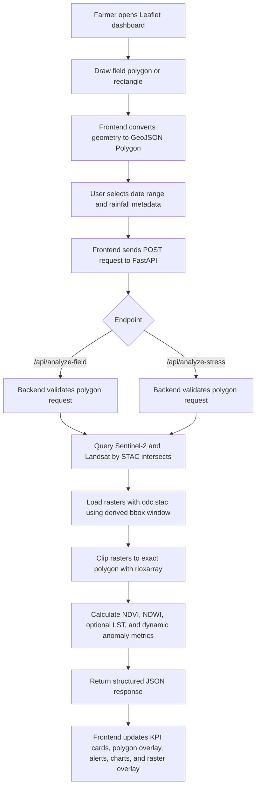
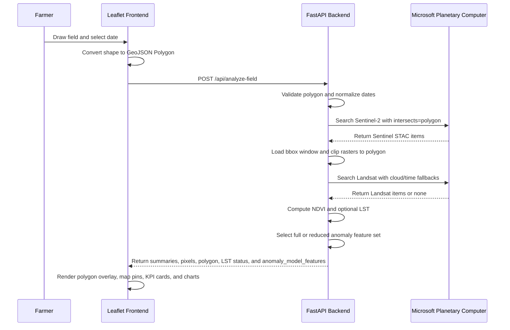

# Data Transfer Workflow

This document explains how field geometry and date inputs move from the Leaflet UI to the FastAPI backend, how the backend processes satellite data with Microsoft Planetary Computer, and how results are returned for map display.

## High-Level Flow



## Dashboard Analysis

The main dashboard sends a GeoJSON Polygon to `/api/analyze-field`. The backend derives a bbox only as an efficient load window; the STAC search itself uses `intersects=polygon`, and loaded rasters are clipped to the exact polygon.

Source file:

`frontend/app.js`

Backend endpoint:

`POST /api/analyze-field`

Example request body:

```json
{
  "polygon": {
    "type": "Polygon",
    "coordinates": [
      [
        [100.521, 14.215],
        [100.5215, 14.215],
        [100.5215, 14.2155],
        [100.521, 14.2155],
        [100.521, 14.215]
      ]
    ]
  },
  "start_date": "2025-01-01",
  "end_date": "2025-02-28",
  "rainfall_15d_mm": 10.0
}
```

Request field notes:

| Field | Meaning |
| --- | --- |
| `polygon` | GeoJSON Polygon geometry in WGS84 lon/lat order. Preferred input for `/api/analyze-field`. |
| `start_date` / `end_date` | Satellite search window in `YYYY-MM-DD` format. |
| `time_range` | Optional alternative to dates, formatted as `YYYY-MM-DD/YYYY-MM-DD`. |
| `rainfall_15d_mm` | Optional rainfall value used by the anomaly model. |
| `bbox` | Backward-compatible fallback. If sent without a polygon, the backend builds a rectangle polygon from it. |

Expected response shape:

```json
{
  "bbox": [100.521, 14.215, 100.5215, 14.2155],
  "polygon": {
    "type": "Polygon",
    "coordinates": [[[100.521, 14.215], [100.5215, 14.215], [100.5215, 14.2155], [100.521, 14.2155], [100.521, 14.215]]]
  },
  "time_range": "2025-01-01/2025-02-28",
  "crs": "EPSG:4326",
  "sentinel_scene_ids": ["S2A_MSIL2A_..."],
  "landsat_scene_ids": ["LC09_L1TP_..."],
  "ndvi_summary": {
    "mean": 0.64,
    "min": 0.31,
    "max": 0.82,
    "valid_pixel_count": 120
  },
  "lst_summary": {
    "mean": 31.2,
    "min": 27.4,
    "max": 36.9,
    "valid_pixel_count": 120
  },
  "lst_status": "available",
  "lst_error": null,
  "anomaly_model_features": ["ndvi", "ndvi_diff", "lst_celsius", "rainfall_15d_mm"],
  "anomaly_count": 0,
  "pixels": [
    {
      "lat": 14.2152,
      "lon": 100.5212,
      "ndvi": 0.64,
      "lst_celsius": 31.2,
      "ndvi_diff": 0.02,
      "rainfall_15d_mm": 10.0,
      "is_anomaly": 0
    }
  ]
}
```

Frontend behavior:

1. Sends the selected polygon and date range to FastAPI.
2. Displays the returned polygon as a result overlay.
3. Renders KPI cards from `ndvi_summary`, `lst_summary`, and anomaly values.
4. Shows the LST source or missing reason under the LST KPI.
5. Uses `anomaly_model_features` for debugging which anomaly mode ran.
6. Places color-coded map alerts from `pixels`.
7. Falls back to a field summary marker if the backend returns summary data but no per-pixel list.

## LST Fallback Behavior

LST is optional. NDVI analysis should still succeed when all thermal data is unavailable.

The backend tries:

1. Landsat search with configured cloud threshold.
2. Relaxed threshold list including `30%` and `CROP_API_RELAXED_MAX_CLOUD_COVER`.
3. Expanded time windows of plus/minus 15 and 30 days for Landsat only.
4. ECOSTRESS LST search with expanded windows if Landsat returns no usable pixels.
5. If still missing, it returns successful NDVI results with:

```json
{
  "lst_summary": {
    "mean": null,
    "min": null,
    "max": null,
    "valid_pixel_count": 0
  },
  "lst_status": "missing",
  "lst_source": "Sentinel-2 Only",
  "lst_error": "No Landsat 8/9 Level-1 scenes with TIRS Band 10 found for the requested polygon/time_range after cloud and time-window fallbacks.",
  "pixels": [
    {
      "lst_celsius": null
    }
  ]
}
```

The frontend displays `-- °C` for missing LST rather than `0.0 °C`.

## Dynamic Anomaly Detection

Sentinel-2 is the required pipeline. If Sentinel-2 succeeds, NDVI and anomaly outputs are produced even when Landsat fails.

The anomaly model switches feature sets:

| LST state | Feature set |
| --- | --- |
| `lst_status: "available"` | `["ndvi", "ndvi_diff", "lst_celsius", "rainfall_15d_mm"]` |
| `lst_status: "missing"` | `["ndvi", "ndvi_diff", "rainfall_15d_mm"]` |

If a micro-polygon has fewer than 8 valid pixels, Isolation Forest cannot fit reliably. The backend still applies rule-based anomaly guards for high rainfall plus sharp NDVI drops, and heat stress when LST exists.

## Raster Data Send

The raster visualization page sends polygon coordinates and expects layer tile URLs for map overlay.

Source file:

`frontend/raster.js`

Backend endpoint:

`POST /api/analyze-stress`

Example request body:

```json
{
  "coordinates": [
    [
      [100.45, 13.65],
      [100.55, 13.65],
      [100.55, 13.75],
      [100.45, 13.75],
      [100.45, 13.65]
    ]
  ],
  "target_date": "2025-03-31"
}
```

Coordinate notes:

| Format | Supported |
| --- | --- |
| GeoJSON polygon coordinates: `[[[lon, lat], ...]]` | Yes |
| Single polygon ring: `[[lon, lat], ...]` | Yes |

Expected response shape:

```json
{
  "tile_url": "https://tiles.example/{z}/{x}/{y}.png",
  "tile_urls": {
    "ndvi": "https://tiles.example/ndvi/{z}/{x}/{y}.png",
    "lst": "https://tiles.example/lst/{z}/{x}/{y}.png",
    "anomaly": "https://tiles.example/anomaly/{z}/{x}/{y}.png"
  },
  "mean_ndvi": 0.58,
  "mean_ndwi": 0.21,
  "mean_lst_celsius": null,
  "lst_status": "missing",
  "lst_error": "No Landsat thermal scene found after fallbacks.",
  "anomaly_count": 7,
  "anomaly_ratio": 0.1429,
  "rainfall_30d_mm": 0.0,
  "risk_level": "normal",
  "valid_pixel_count": 49,
  "pixel_count": 49,
  "source": "Microsoft Planetary Computer"
}
```

Raster frontend behavior:

1. Stores the returned payload as the active raster payload.
2. Enables only layer buttons with a URL in `tile_urls`.
3. Switches Leaflet overlays locally when the user clicks NDVI, LST, or anomaly.
4. Shows `--` for null metrics such as missing `mean_lst_celsius`.
5. Allows manual testing through a JSON file imported with the same response shape.

## Sequence Diagram



## Error Handling

| Error | Why it happens | User-facing behavior |
| --- | --- | --- |
| `404 Not Found` | Frontend posts to the wrong route. | Check API base URL and endpoint path. |
| `422 Unprocessable Entity` | Request body is not a valid GeoJSON polygon or date range. | Show validation message and inspect payload shape. |
| No Sentinel-2 imagery | No usable vegetation imagery for polygon/date range. | Ask user to widen date range or change field. |
| Missing Landsat LST | No TIRS Band 10 scene after cloud/time fallbacks, or LST conversion failed. | Keep NDVI results visible, return `mean_lst_celsius: null`, disable unavailable LST tiles, and show `lst_status: "missing"`. |
| Tile overlay fails | Tile URL expired or raster service unavailable. | Keep KPI results visible and show tile warning. |
| Empty pixel result | Backend processed summary but no displayable pixel list was returned. | Add field-level summary marker on the map. |

## Quick Debug Commands

Run backend health check:

```powershell
Invoke-RestMethod http://127.0.0.1:8000/api/health
```

Test polygon analysis:

```powershell
$body = @{
  polygon = @{
    type = "Polygon"
    coordinates = @(
      @(
        @(100.521, 14.215),
        @(100.5215, 14.215),
        @(100.5215, 14.2155),
        @(100.521, 14.2155),
        @(100.521, 14.215)
      )
    )
  }
  start_date = "2025-01-01"
  end_date = "2025-02-28"
  rainfall_15d_mm = 10.0
} | ConvertTo-Json -Depth 8

Invoke-RestMethod `
  -Uri http://127.0.0.1:8000/api/analyze-field `
  -Method Post `
  -ContentType "application/json" `
  -Body $body
```

Test raster stress analysis:

```powershell
$body = @{
  coordinates = @(
    @(
      @(100.45, 13.65),
      @(100.55, 13.65),
      @(100.55, 13.75),
      @(100.45, 13.75),
      @(100.45, 13.65)
    )
  )
  target_date = "2025-03-31"
} | ConvertTo-Json -Depth 6

Invoke-RestMethod `
  -Uri http://127.0.0.1:8000/api/analyze-stress `
  -Method Post `
  -ContentType "application/json" `
  -Body $body
```
