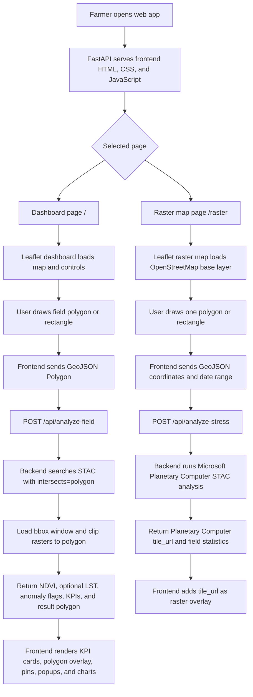
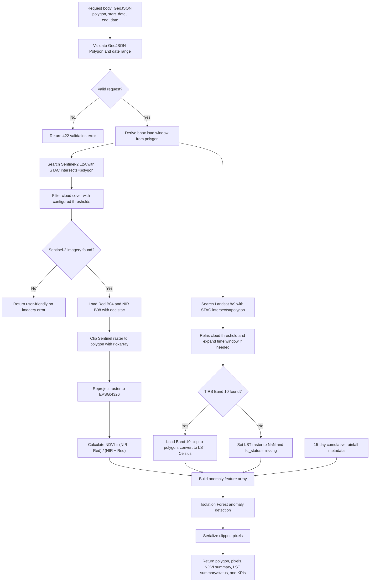
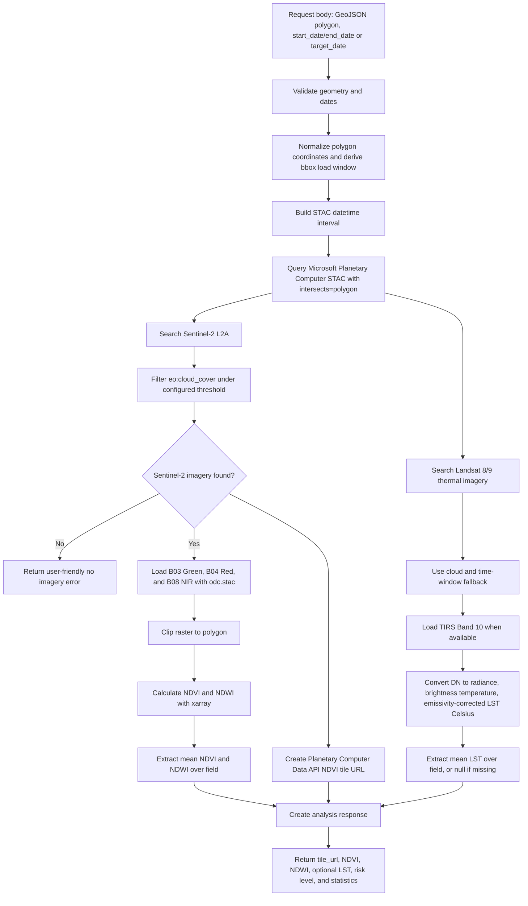
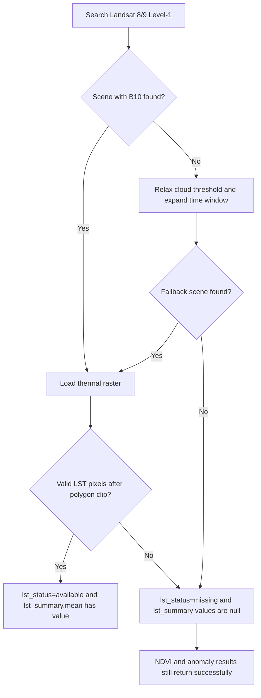
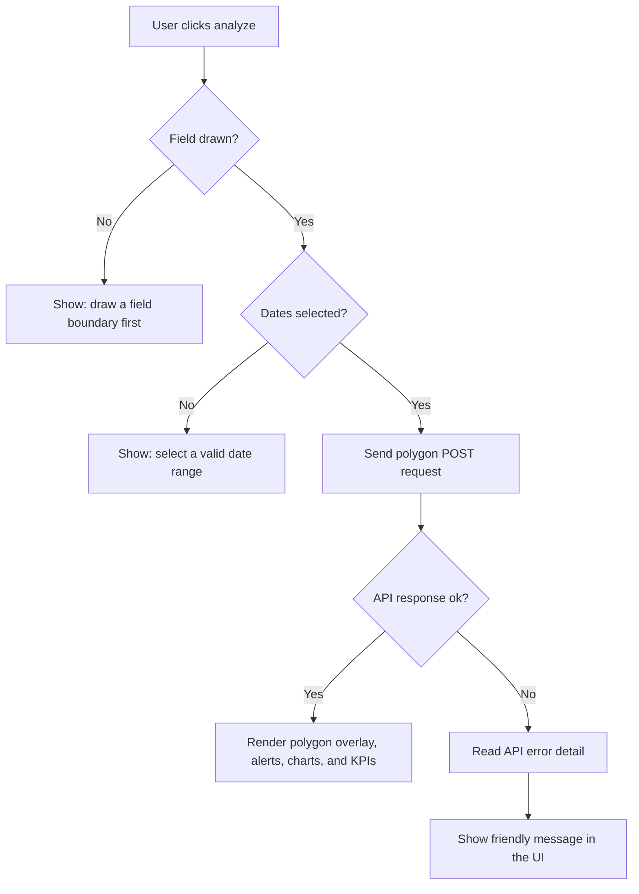

# Web Processing Flowchart

This document shows the main processing flow for the Satellite-Based Crop Planting and Management System.

## Overall Web Flow

## Dashboard Analysis Flow

## Raster And Planetary Computer Stress Flow

## LST Missing Flow

## Frontend Error Flow

## Endpoint Summary

| Endpoint | Used By | Main Purpose |
| --- | --- | --- |
| `GET /` | Dashboard UI | Main crop health dashboard |
| `GET /raster` | Raster UI | NDVI/LST raster overlay map |
| `POST /api/analyze-field` | Dashboard UI | Polygon-clipped STAC NDVI, optional LST, anomaly, and KPI processing |
| `POST /api/analyze-stress` | Raster UI | Planetary Computer field stress statistics and tile overlay |
| `GET /api/health` | Scripts and monitoring | API readiness check |
